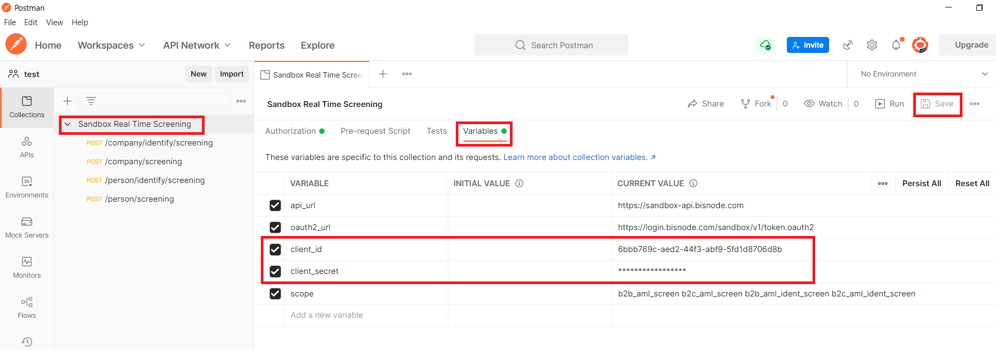
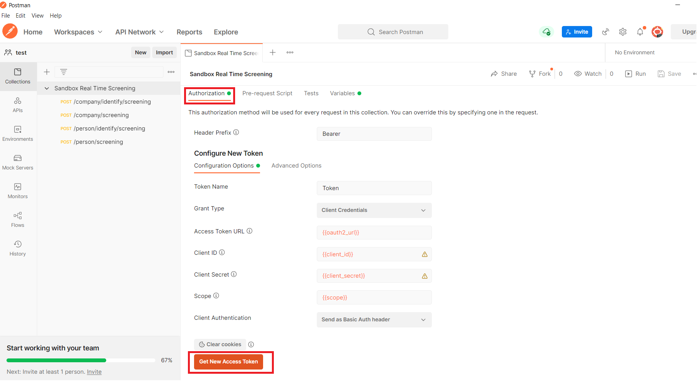
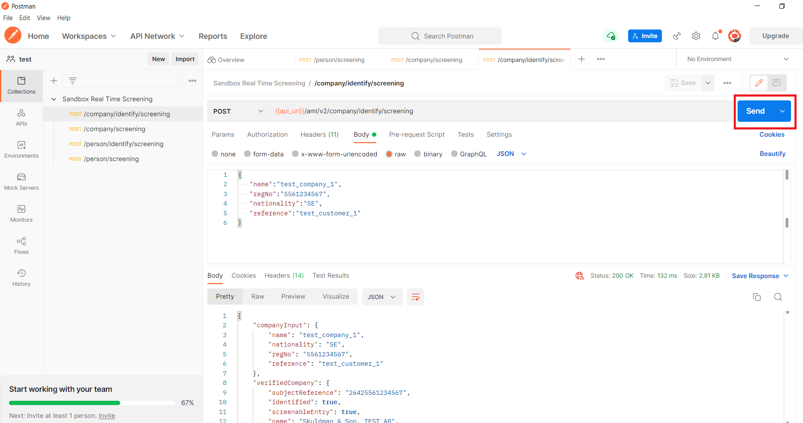

## Folder containing postman collections for easy testing

##

Below you find instructions about how to step by step set up a simple Postman collection that enables you to test Bisnode Real Time screening API and play around in a Bisnode sandbox environment. Postman can be downloaded here: https://www.getpostman.com/downloads/ 

Get started with Bisnode Real Time screening API:

1. Download and import Postman collection [_Sandbox_Real_Time_Screening.postman_collection.json_](Sandbox_Real_Time_Screening.postman_collection.json) into your Postman instance.

2. Go to https://sandbox-portal.bisnode.com/

3. Sign in with your Bisnode-id or your github account.

4. Generate your sandbox credentials.

5. Open Postman and set client id and set client_id and client_secret and press "Save" button

6. Next open Authorization tab and click on "Get new access token" and next "Use token"

7. Choose one operation and click on "Send"

                                                Happy testing!
